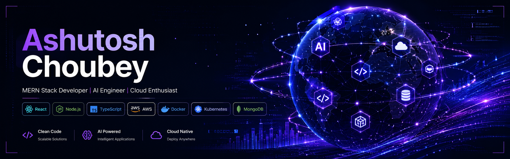

<div align="center">

<p align="center">
  
</p>


<br/>
<br/>


 
<br/><br/> 
<a href="mailto:ashutoshch27@gmail.com">  </a> 
<a href="https://linkedin.com/in/ashutoshchoubey">  </a>
<a href="https://github.com/Ashutosh-Choubey27">  </a> 
 <br/><br/>

</div>

---

# About Me

Full-Stack Developer passionate about building scalable web applications using React, JavaScript, Node.js, Express, MongoDB, and modern cloud technologies.

Recently built and deployed an <strong> "AI-Enhanced Hospital Queue Management System" </strong>, featuring real-time queue tracking with Socket.io, JWT-based authentication, role-based access control, ML-powered wait-time prediction using FastAPI, and production deployment on Vercel, Render, and MongoDB Atlas.

Previously developed an <strong> "AI-Based Smart Productivity Planner" </strong> with intelligent task management, smart scheduling, productivity analytics, and modern responsive UI/UX design.

Currently working on </strong> MarkiAI (AI Digital Marketing Head) </strong> — an AI-powered SaaS platform designed to automate digital marketing workflows for agencies and businesses. The platform leverages AI to perform website and social media audits, generate data-driven marketing strategies, create SEO-optimized content, and support multi-tenant architecture with BYOM (Bring Your Own Model) AI integrations.

Currently exploring Docker, AWS, TypeScript, system design, and cloud deployment while continuously improving my GitHub portfolio through real-world projects and consistent JavaScript learning.

---

# Tech Stack

## Languages

<div align="center">


</div>

## Frontend

<div align="center">


</div>

## Backend & Databases

<div align="center">


</div>

## Cloud, DevOps & Tooling

<div align="center">


</div>

---

# Skill Icons

<div align="center">

[](https://skillicons.dev)

</div>

---

# AI / ML Expertise

| Domain | Proficiency | Details |
|---|---|---|
| AI Product Engineering | Advanced | Built AI-powered productivity and healthcare systems |
| Machine Learning Integration | Intermediate | Python ML microservices, prediction APIs, wait-time estimation |
| Data-Driven Applications | Advanced | Analytics dashboards, productivity metrics, queue insights |
| Real-Time Intelligence | Advanced | Socket.io-based real-time queue and activity systems |
| Full Stack AI Systems | Advanced | React + Node.js + Python ML architecture |
| RAG & Agentic AI | Learning | Building AI GitHub Project Explainer |

---

# Featured Projects

<details>
<summary><b>AI-Enhanced Hospital Queue Management System</b></summary>

<br/>

AI-powered hospital queue and appointment management system designed to optimize patient flow, real-time token tracking, doctor dashboards, and wait-time prediction.

| Category | Details |
|---|---|
| Stack | React, Node.js, Express.js, MongoDB, Socket.io, Python ML |
| Scale | Multi-role healthcare platform |
| Performance | Real-time queue updates using Socket.io |
| Security | JWT Authentication, Role-Based Access Control |
| Impact | Improved patient queue visibility and operational flow |
| Live | https://ai-enhanced-hospital-queue-manageme.vercel.app |
| Repository | https://github.com/Ashutosh-Choubey27 |

### Key Engineering Highlights

- Built smart appointment booking and queue check-in flow
- Integrated ML microservice for crowd and wait-time prediction
- Designed dashboards for patients, doctors, and admins
- Implemented priority-based queue handling for emergency and senior patients
- Used real-time communication for live queue tracking

</details>

<details>
<summary><b>AI-Powered Smart Productivity Planner</b></summary>

<br/>

Full-stack productivity platform built to help students manage tasks, focus sessions, scheduling, analytics, and AI-powered task breakdown.

| Category | Details |
|---|---|
| Stack | React, TypeScript, Supabase |
| Scale | Student productivity SaaS |
| Performance | Real-time collaboration and offline support |
| Security | Supabase Auth and protected data access |
| Impact | Improved task planning, focus, and productivity tracking |
| Live | https://smart-productivity-planner-five.vercel.app |
| Repository | https://github.com/Ashutosh-Choubey27 |

### Key Engineering Highlights

- Built AI-driven task breakdown and smart scheduling
- Added productivity heatmaps and analytics dashboards
- Designed drag-and-drop task management interface
- Implemented Pomodoro timer and Focus Mode
- Used Supabase for authentication and database operations

</details>

<details>
<summary><b>AI GitHub Project Explainer</b></summary>

<br/>

An upcoming AI-powered developer tool that explains GitHub repositories, architecture, folder structure, dependencies, and code flow using modern AI workflows.

| Category | Details |
|---|---|
| Stack | React, Node.js, AI APIs, GitHub API |
| Scale | Developer productivity tool |
| Performance | Repository-level analysis |
| Security | Token-based GitHub access planned |
| Impact | Helps developers understand unknown codebases faster |
| Repository | Coming Soon |

### Planned Highlights

- GitHub repository ingestion
- AI-based project explanation
- Folder and architecture breakdown
- Code flow understanding
- Developer-friendly documentation generation

</details>

---

# Experience

## Technical Engineer — iEnergizer

**Oct 2023 – Apr 2024**

Worked in a high-volume technical support environment focused on troubleshooting, diagnostics, customer assistance, and service coordination.

### Scope of Work

- Troubleshot 300+ electronic devices including LED TVs, Amazon Alexa, and laptops
- Assisted 500+ customers monthly with technical issue resolution
- Achieved 95% first-contact resolution rate
- Resolved 600+ hardware and software support cases
- Coordinated 150+ installation and maintenance requests

### Skills

`Troubleshooting` `Technical Support` `Customer Handling` `Diagnostics` `Communication` `Incident Resolution`

---

# Achievements

<div align="center">

| Recognition | Details |
|---|---|
| Innovation Award | 1st Prize — Smart Portable Charging Case |
| Academic Excellence | MCA CGPA 8.2 |
| Quiz Competition | Swami Vivekanand Quiz Award — 2nd Position |
| Product Engineering | Built AI-powered healthcare and productivity systems |
| Cloud Learning | Completed AWS Cloud Practitioner Essentials |

</div>

---

# Certifications

## AWS


## Cisco


## NPTEL


## Oracle / Database


## Additional


---

# Coding Profiles

<div align="center">

<a href="https://leetcode.com">

</a>

<a href="https://geeksforgeeks.org">

</a>

<a href="https://hackerrank.com">

</a>

<a href="https://codechef.com">

</a>

</div>

---

# GitHub Analytics

<div align="center">


</div>

---

# Contribution Eater Snake

<p align="center">
  <picture>
    <source media="(prefers-color-scheme: dark)" srcset="https://raw.githubusercontent.com/Ashutosh-Choubey27/Ashutosh-Choubey27/output/github-contribution-grid-snake-dark.svg">
    <source media="(prefers-color-scheme: light)" srcset="https://raw.githubusercontent.com/Ashutosh-Choubey27/Ashutosh-Choubey27/output/github-contribution-grid-snake.svg">
    
  </picture>
</p>

---

# Contribution Activity

<div align="center">


</div>

---

---

# Current Focus

```yaml
Learning:
  - Advanced React
  - TypeScript
  - AWS Cloud
  - Docker
  - Kubernetes
  - System Design

Building:
  - AI GitHub Project Explainer
  - AI-Powered Full Stack Products
  - Cloud-Native MERN Applications

Exploring:
  - RAG Systems
  - Agentic AI
  - Scalable Backend Architecture
  - DevOps Workflows

Open_To:
  - Software Engineer Roles
  - MERN Stack Developer Roles
  - Full Stack Developer Roles
  - AI Product Engineering Opportunities
````

---

# Connect

<div align="center">

<a href="mailto:ashutoshch27@gmail.com">

</a>

<a href="https://linkedin.com/in/ashutoshchoubey">

</a>

<a href="https://github.com/Ashutosh-Choubey27">

</a>

<a href="#">

</a>

</div>

---

<div align="center">


</div>
